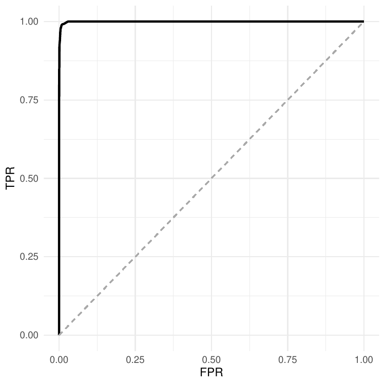
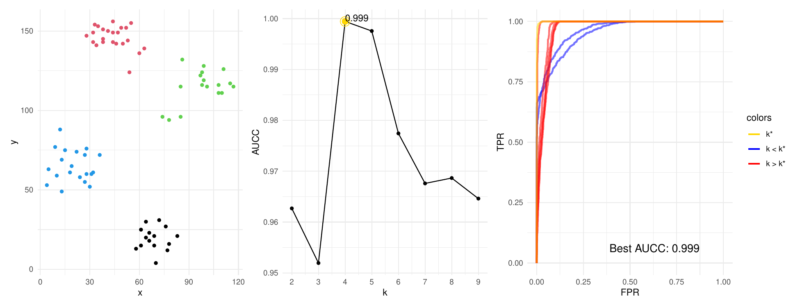
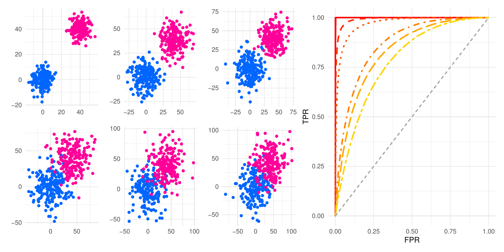
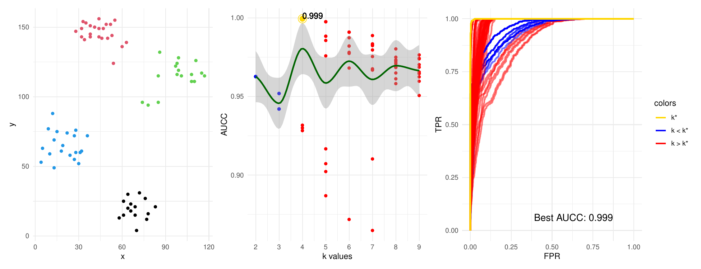

<!-- PROJECT LOGO -->
<br />
<div align="center">
<h1 align="center">Cluster Confusion</h3>
<p align="center"> Clustering validation that makes sense.  </p>
</div>

<!-- ABOUT THE PROJECT -->
## About The Project

This package provides an implementation of the Area Under the (ROC) Curve for clustering (AUCC), which can be employed to validate clustering results and select the best number of clusters from a pool of partitions. The measure is described in our ECML/PKDD paper, which was published in the Journal track:

 *Jaskowiak, P.A., Costa, I.G. & Campello, R.J.G.B. The area under the ROC curve as a measure of clustering quality. Data Mining and Knowledge Discovery 36, 1219–1245 (2022).* Available at: https://doi.org/10.1007/s10618-022-00829-0

More clustering validation measures and cool stuff coming soon.

## Examples

Here you find some examples on how clusterConfusion can be used.

#### Example 1
Just compute the AUCC value of a single partition.

```{r}
library(clusterConfusion)
library(ggplot2)

partition <- kmeans(ruspini,4)$cluster

#Just outputs the value
aucc(partition, dataset = ruspini)

#Getting a complete 'aucc' object, so we can plot its curve
res <- aucc(partition, dataset = ruspini, returnRates = TRUE)
rocPlot(res)

```

You will get the following plot (actually, you may get a different one, depending on the k-means random start):


<p align="center">
  
</p>

#### Example 2

Just a run on the well-known Ruspini dataset. From left to right: best partition suggested by AUCC. The AUCC values for different values of k (number of clusters), the ROC Curves for each one of the partitions. You can get this plots with the followin code:

```{r}
library(clusterConfusion)
library(ggplot2)

partitions <- list()

#varying k in a reasonable range...
for (k in 2:ceiling(sqrt(dim(ruspini)[1]))) {
   partitions <- append(partitions,list(kmeans(ruspini,k)$cluster))
}
res <- clusteringROCs(partitions,dataset = ruspini,show = FALSE, decorate = TRUE, alphaPlot = FALSE)

# Plot the dataset colored with the best partition labels
dataPlot <- ggplot(ruspini) + 
            geom_point(aes(x,y),color=as.integer(partitions[[which.max(res$auccs)]])) + 
            theme_minimal()


require(patchwork) #for combining the plots.
dataPlot + res$auccplot + res$rocplot
```

<p align="center">
  
</p>

#### Example 3

Below you can find Fig. 5 from our paper (see references). It shows six different datasets with increasing variance in the clusters. For each dataset we show the corresponding curves in the right. The higher the cluster variance, the lower the AUCC values for the clusterings.

<p align="center">
  
</p>

The six datasets are embedded in clusterConfusion. You can generate the plot with the following code:

```{r}
library(clusterConfusion)
library(ggplot2)

#Just picking some nice colors
colorsScatter <- c("#0066FF","#FF0099")
colorROCS     <- heat.colors(9)

data     <- c()
distance <- c()

#Just place all the Gaussian data in a list so we can iterate
#All these datasets are loaded within the package

data[[1]] <- gData1
data[[2]] <- gData2
data[[3]] <- gData3
data[[4]] <- gData4
data[[5]] <- gData5
data[[6]] <- gData6

rPlot <- NULL     #We will store the ROC Plots here
dPlot <- list()   #And the data scatter plots here

#So now we iterate over the six datasets...
for (d in 1:6) {

  #Store the results of the AUCC considering the ground truth and the distance (aucc object)
  r <- aucc(partition = as.integer(data[[d]][,3]), dataset = data[[d]][,-3], returnRates = TRUE)

  #For the first dataset, we make a new plot (addToPlot=NULL). For the following plots
  #we call the same function, but we add the new curves (addToPlot = rPlot). We choose
  #not to show each plot (showPlot=FALSE). We'll compose all togheter in the end

  if (d==1) {
    rPlot <- rocPlot(r, addToPlot = NULL, col=colorROCS[d],
                     lineType = d, sampleSize = 3000, showPlot = FALSE)
  } else {
    rPlot <- rocPlot(r, addToPlot = rPlot, col=colorROCS[d],
                     lineType = d, showPlot = FALSE)
  }

  #We make a separate scatter plot for each one of the datasets
  dPlot[[d]] <- ggplot(data[[d]],aes(x=x,y=y,color=class)) +
    geom_point() +
    theme_minimal() +
    scale_color_manual(values=colorsScatter) +
    theme(legend.position="none") +
    xlab(element_blank()) +
    ylab(element_blank())

}

#We now put everything together. This is the same plot presented in Fig. 5 of the reference paper.

require(patchwork) #we need this library in order to compose the ggplots in the following line
print((((dPlot[[1]] | dPlot[[2]] | dPlot[[3]])/
         (dPlot[[4]] | dPlot[[5]] | dPlot[[6]]))|rPlot) + plot_layout(widths = c(4,2.5)))
```

#### Example 4

Maybe you have a list of partitions (even with more than one partition per value of k). No worries. You can evaluate all of them and even get a nice plot on the go. In the middle plot we depict all evaluations from AUCC (note that now we have more than one partition per k). We then fit a line [loess](https://www.rdocumentation.org/packages/stats/versions/3.6.2/topics/loess) just to have an idea on the trend of the values. The res object has both plost from the right and all AUCC values within it.

```{r}
library(clusterConfusion)
library(ggplot2)

partitions <- list()

#varying k in a reasonable range...
for (k in 2:ceiling(sqrt(dim(ruspini)[1]))) {
   partitions <- append(partitions,list(kmeans(ruspini,k)$cluster))
}
res <- clusteringROCs(partitions,dataset = ruspini,show = FALSE, decorate = TRUE, alphaPlot = FALSE)

# Now we just add more and more partitions to the list, with same number of k
# Same

for (r in 1:10) {
   for (k in 2:ceiling(sqrt(dim(ruspini)[1]))) {
      partitions <- append(partitions,list(kmeans(ruspini,k)$cluster))
   }
}

res <- clusteringROCs(partitions,dataset = ruspini,show = FALSE, decorate = TRUE, alphaPlot = FALSE)


# Plot the dataset colored with the best partition labels
dataPlot <- ggplot(ruspini) + 
            geom_point(aes(x,y),color=as.integer(partitions[[which.max(res$auccs)]])) + 
            theme_minimal()

require(patchwork) #for combining the plots.
dataPlot + res$auccplot + res$rocplot

```

<p align="center">
  
</p>

<!-- Installation -->
## Installation

```{r}
install.packages("devtools")
devtools::install_github("https://github.com/pajaskowiak/clusterConfusion")
require(clusterConfusion)
```

<!-- USAGE EXAMPLES -->
## Usage

Just open an R Session and check usage examples as below:

```{r}
library(clusterConfusion)

# Main AUCC function
?aucc

# Function to plot ROC Curves from clustering solutions
?rocPlot

# Compute AUCC and make plots from list of partitions
?clusteringROCs
```


<!-- CITE -->
## How to Cite

Please, if you use our method cite our paper:

[1] *Jaskowiak, P.A., Costa, I.G. & Campello, R.J.G.B. The area under the ROC curve as a measure of clustering quality. Data Mining and Knowledge Discovery 36, 1219–1245 (2022).* Available at: https://doi.org/10.1007/s10618-022-00829-0

If you also use our implementation, consider citing our git repository as well.

<!-- CONTACT -->
## Contact

Pablo Andretta Jaskowiak - pablo.andretta@ufsc.br

Project Link: [https://github.com/pajaskowiak/clusterConfusion](https://github.com/pajaskowiak/clusterConfusion)

With thanks to [James Nagai](https://jsnagai.github.io/) for help with some ggplots details.
